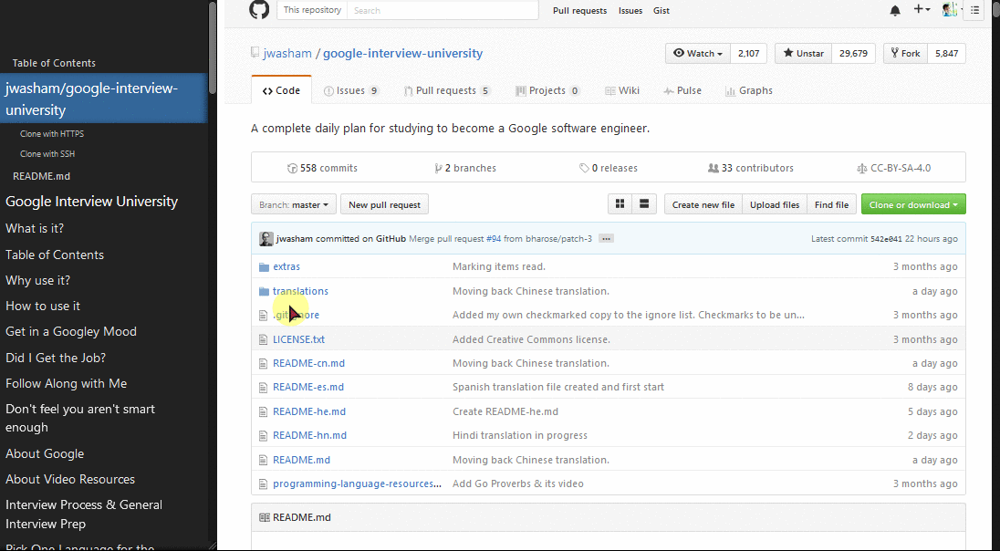

Auto Table of Content
=====================

I believe that every article on web should have a table of content.

> This userscript is not production-ready yet. There's many improvement points.
> See [TODO list](https://github.com/letientai299/userscript-auto-toc/issues/1).

Demo
----

TOC on Github

More:
- [Medium](./demo/firefox-medium.jpg)
- [Wikipedia](./demo/firefox-wikipedia-normal.jpg)
- [Wikipedia custom theme](./demo/firefox-wikipedia-stylish-wikitex.jpg) with the awesome
 [Stylish](https://addons.mozilla.org/en-US/firefox/addon/stylish/?src=hp-dl-featured) theme [WikiTex](https://github.com/AndrewBelt/WiTeX)

How to use
----------

### Install

- Choose a userscript engine for your favorist browser:
  - Greasemonkey: [Firefox](https://addons.mozilla.org/en-US/firefox/addon/greasemonkey/)
  - Tampermonkey: [Chrome](https://chrome.google.com/webstore/detail/tampermonkey/dhdgffkkebhmkfjojejmpbldmpobfkfo?hl=en), [Firefox](https://addons.mozilla.org/en-US/firefox/addon/tampermonkey/), [Opera](https://addons.opera.com/en/extensions/details/tampermonkey-beta/?display=en)
  - ViolentMonkey: [Opera](https://addons.opera.com/en/extensions/details/violent-monkey/),
    [Chrome](https://chrome.google.com/webstore/detail/violent-monkey/jinjaccalgkegednnccohejagnlnfdag/reviews?hl=en)

- Install script via [this link](https://cdn.rawgit.com/letientai299/userscript-auto-toc/master/auto-toc.user.js).

### Usage

- Open a Github, Wikipedia or Medium article, the TOC should be opened
  automatically after page is loaded. For example, try with
  [this page](https://github.com/jwasham/google-interview-university):

- TOC can be toggle using the shortcut key `Alt+q`.

### Show TOC on Firefox Markdown Previewer
-------------------------------------------

This feature only works properly on Firefox with
[Markdown Previewer](https://addons.mozilla.org/en-US/firefox/addon/markdown-viewer/) as of now. See [demo](./demo/firefox-markdown-preview-addon.jpg)

- Open `about:config`.
- Look for `greasemonkey.fileIsGreaseable`, set to `true`.
- Restart Firefox.
- Try with any local Markdown file.

License
-------

MIT
